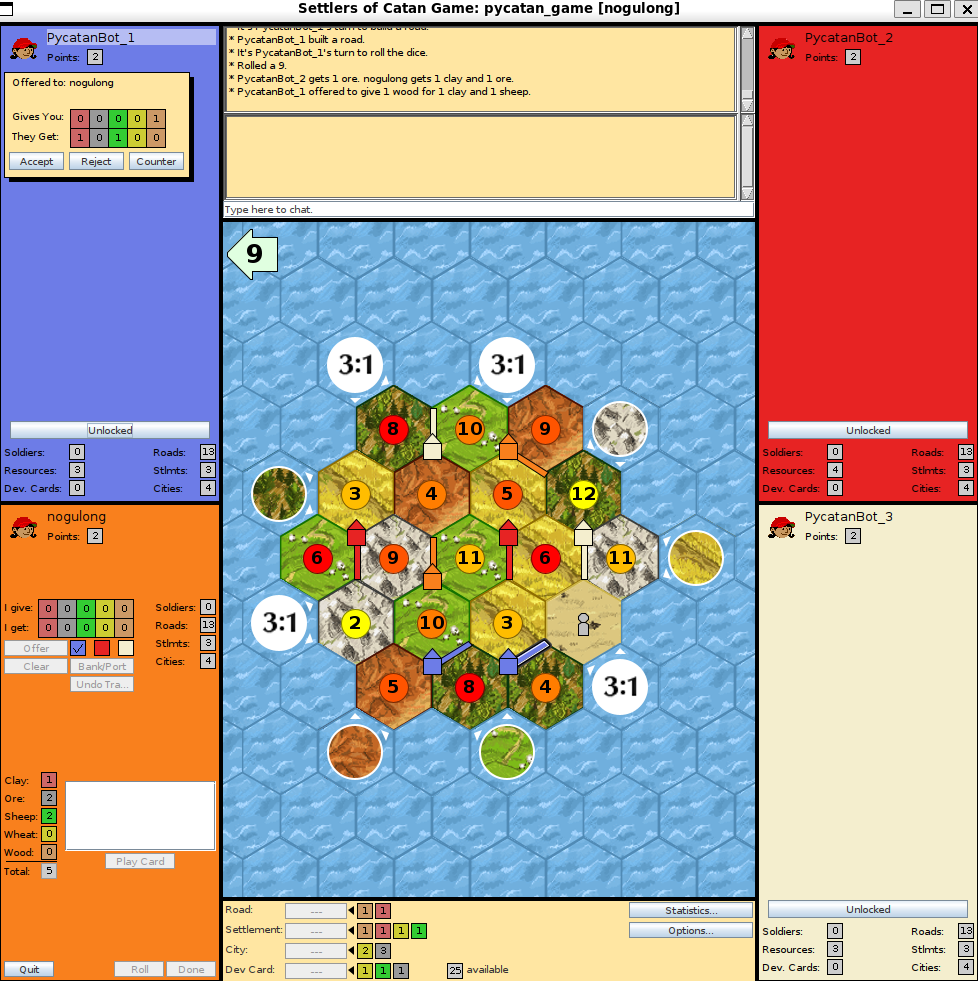

# rust-catan-rl
A Rust implementation for the board game Catan

This is a fork of [Swynfel's rust-catan](https://github.com/Swynfel/rust-catan), enhanced with custom utilities based on our research. Most notably, you can play Catan against our powerful AI agents, which were trained entirely through end-to-end Reinforcement Learning (RL). A paper detailing our research and methodology is currently in preparation.

## Quick Start

Getting started is very simple. Just execute the following command in your terminal to launch the JSettlers GUI and start playing:

```bash
maturin develop --release
play-catan
```

After the JSettlers GUI opens, fill in your nickname, join the game, and sit down in an empty seat.



## License and Acknowledgments

The core code of this project is licensed under the [MIT License](LICENSE) - see the LICENSE file for details.

This project integrates and communicates with the following open-source software. We are deeply grateful to their developers:

**Rust-catan**: Originally created by Swynfel, licensed under the [MIT License](LICENSE.rust_catan).

**JSettlers2**: Used as an independent graphical frontend and client-server component. Licensed under the [GNU General Public License (GPL)](external/jsettlers/COPYING-GPLv3.txt).

Please note that while this main repository is provided under the MIT License, the JSettlers component retains its original GPL license to comply with its terms.
